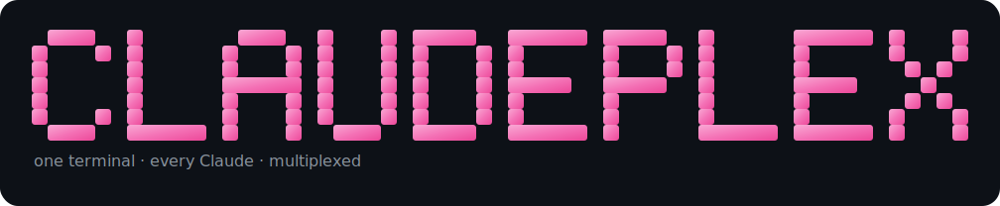

<p align="center">
  
</p>

<p align="center">
  <b>A terminal multiplexer &amp; cockpit for <a href="https://github.com/anthropics/claude-code">Claude Code</a>.</b><br>
  Monitor and orchestrate <i>multiple</i> Claude Max accounts from one TUI — like <code>tmux</code>, but for your Claudes.
</p>

<p align="center">
  
  
  
</p>

## What is this?

If you run Claude Code across several accounts — a personal Max plan, a work account, a
client login, each under its own `CLAUDE_CONFIG_DIR` — you lose the overview fast. Which
account is burning through its 5-hour window? Which sessions are mid-task vs. waiting on you?
Where did that one agent run again?

**Claudeplex** puts all of it in a single animated terminal dashboard:

- **Live load per account** — 5-hour and weekly token usage, cost and reset timers, heat-colored so you can see at a glance who has headroom.
- **Every session at a glance** — running, waiting and recent sessions across all accounts, grouped by working folder, with live activity tails.
- **A cockpit to drive agents** — launch headless Claude agents, talk to them, paste images, restart them to pick up new plugins/MCP, and adopt sessions that are waiting for input.
- **Zero config** — it auto-discovers your Claude accounts; no aliases or setup files required.

It is **read-only** on your Claude config dirs (it never writes to them) and runs entirely on
your machine — see [Security &amp; privacy](#security--privacy).

## Features

- 📊 **Multi-account load dashboard** — 5h / weekly usage, cost and reset countdowns per account.
- 🖥️ **Session monitor** — live + recent sessions across all accounts, grouped by folder, with status (active / monitor / waiting / stale) and live output tails.
- 🚀 **New-agent wizard** — a popup to launch a fresh agent: pick an account (by spare capacity) → pick a working folder, or flip it the other way (folder → account). Spans your full project history.
- 🎛️ **Agent cockpit** — message agents directly, attach clipboard images, restart, kill, and take over sessions that are waiting on you.
- 🔎 **Auto-discovery** — finds every Claude account on the machine. No shell aliases needed.
- 🧭 **Multi-host Commander** — browse every SSH/Tailscale host as a network neighbourhood, navigate remote filesystems over SFTP, copy files host↔host without scp, and shell-out into a real remote PTY (`h`).
- 🛰️ **Remote-control fleet** — launch persistent `claude remote-control` servers (in tmux, so they survive the lid closing) that serve both the TUI and the Claude mobile app, governed by a RAM ceiling so they never OOM the box.
- 🎨 **Lumen themes** — 6 truecolor themes with light-from-above gradient surfaces, switchable live (`p`).
- 🌍 **Bilingual UI** — English / German, auto-detected from `$LANG`, toggle live.
- 🧩 **Scriptable** — `--json` emits a machine-readable snapshot: `{ accounts, remote }` (accounts/usage/sessions + the remote-control fleet and governor).

## Requirements

- **[Claude Code](https://github.com/anthropics/claude-code)** installed and **at least one account signed in** (`claude` → login). Claudeplex drives the real `claude` CLI.
- **macOS** (primary target — fullscreen and clipboard use `osascript`/`pbpaste`). Linux mostly works; those niceties degrade gracefully.
- **[Bun](https://bun.sh)** ≥ 1.1 — only to run from source. The prebuilt binaries bundle the runtime, so end users won't need it.

## Install

### Homebrew (macOS)

```bash
brew install byte5ai/tap/claudeplex
```

### Install script (macOS / Linux)

```bash
curl -fsSL https://raw.githubusercontent.com/byte5ai/claudeplex/main/install.sh | sh
```

Downloads the standalone binary for your OS/arch from the latest GitHub Release into
`/usr/local/bin` (or `~/.local/bin`). No Bun required.

### From source

```bash
git clone https://github.com/byte5ai/claudeplex.git
cd claudeplex
bun install
bun start
```

## Quick start

```bash
claudeplex          # the live dashboard (fullscreen TUI)
claudeplex --once   # render a single frame and exit
claudeplex --json   # machine-readable snapshot (no TTY needed)
```

> Running from source? Use `bun start`, `bun run once`, `bun run json`.

First run with no accounts detected? You'll get a friendly screen telling you to sign in with
`claude`. Got several accounts? Just give each its own `CLAUDE_CONFIG_DIR` — Claudeplex finds
them automatically (next section).

## How accounts are discovered

Claude Code stores everything for an account (sessions, usage, login) under one directory
pointed to by `CLAUDE_CONFIG_DIR`. To run multiple accounts you give each its own dir, e.g.:

```bash
# ~/.zshrc — one alias per account
alias c1='CLAUDE_CONFIG_DIR=~/.claude        claude'   # personal
alias c2='CLAUDE_CONFIG_DIR=~/.claude-work   claude'   # work
alias c3='CLAUDE_CONFIG_DIR=~/.claude-client claude'   # a client
```

**You do not need those aliases for Claudeplex.** At startup it builds the account list from
the union of three sources, de-duplicated by absolute path:

1. **Filesystem scan** — every `~/.claude` and `~/.claude-*` directory that looks like a real
   account (has a `.claude.json`, `projects/` or `sessions/`). Helper dirs like `~/.claude-mem`
   are skipped.
2. **Running processes** — any live `claude` process started with an explicit
   `CLAUDE_CONFIG_DIR=…` (catches accounts living outside `$HOME`).
3. **Environment** — `$CLAUDE_CONFIG_DIR`, if set.

The bare `~/.claude` is only shown when it actually holds its own login (otherwise it's just
Claude Code's default config dir and would be noise). Each account's **label** is derived from
its account metadata (organization name, else the email's local-part), its **color** from a
palette, and its **key** (`c1`, `c2`, …) from a stable sort — so colors and keys don't reshuffle
between runs.

### Manual override (`~/.config/claudeplex/instances.json`)

Want to pin labels, recolor, reorder, or hide an account? Drop an optional JSON file at
**`~/.config/claudeplex/instances.json`**. It's an array of overrides matched to an account by
its `configDir`; every field is optional:

```jsonc
[
  // pin a friendly label + color for the personal account
  { "configDir": "/Users/you/.claude",        "key": "c1", "label": "personal", "color": 213, "order": 0 },

  // work account, force it to sort first
  { "configDir": "/Users/you/.claude-work",   "key": "wk", "label": "work",     "color": 81,  "order": 1 },

  // discovered, but you never want to see it
  { "configDir": "/Users/you/.claude-archive", "hide": true }
]
```

| Field | Meaning |
|-------|---------|
| `configDir` | **required** — absolute path of the account dir this override applies to |
| `key` | short id shown in the UI (default `c1`, `c2`, …) |
| `label` | human label (default: derived from account metadata) |
| `color` | accent color as a 256-color code (default: from palette) |
| `order` | explicit sort position (lower = earlier) |
| `hide` | `true` to drop the account from the dashboard entirely |

Overrides win over discovery; anything you leave out keeps its auto-derived value. Changes take
effect on the next launch (or press `r` to rescan).

## Keybindings

**Grid (home)**

| Key | Action |
|-----|--------|
| `↑/↓` | select account |
| `→` / `⏎` | open account detail (sessions) |
| `Tab` / `1`–`3` | switch region: ① cards · ② live output · ③ waiting/stale |
| `c` | open the agent **cockpit** |
| `n` | **new-agent wizard** (popup) |
| `N` | quick-launch an agent on the selected account |
| `A` | start an agent on every account |
| `h` | open the multi-host **Commander** |
| `p` | open the live **theme picker** |
| `i` | quick-issue (draft + file a GitHub issue) |
| `L` | toggle language (EN/DE) |
| `r` / `q` | rescan / quit |

**Commander (`h`)** — a multi-host file & control cockpit. Ebene 0 lists every host (your `~/.ssh/config`, live Tailscale peers, a manual list, plus the local machine). Pick a host to open Ebene 1: a **two-pane** SSH/SFTP file browser. `↑/↓` select · `→`/`⏎` open dir · `←` up · `Tab` switch the active pane · `c` **copy** the selected file/dir into the *other* pane's directory — host↔host, scp without the scp · `s` **shell-out** into a real PTY in that dir (replaces the iTerm SSH-tab dance) · `L` launch a `claude remote-control` server there (local **or** remote host) · `K` stop it · `a` attach into the live server · `Esc` re-pick the pane's host. A RAM bar shows that host's remote-control fleet against the governor ceiling, with a calibrated "~N more sessions fit" estimate.

**Theme picker (`p`)** — 6 live themes (Lume Atelier · Petrol · Lagoon · Monochrome · Tokyo Night · Catppuccin). `↑/↓` previews instantly, `⏎` applies + persists, `Esc` restores.

**New-agent wizard** — `↑/↓` move · `Tab` `→` next pane · `←` back · `^T` flip orientation (account↔folder) · `⏎` launch · `Esc` cancel

**Cockpit** — type to message the agent · `⏎` send · `^V` paste image · `Tab` open-questions list · `^N` new agent · `^R` restart · `^K` kill · `Esc` back

**Detail / transcript** — `↑/↓` navigate · `→`/`⏎` open transcript · `PgUp/PgDn` scroll · `←`/`Esc` back

**Waiting/stale region (③)** — `⏎` open in cockpit · `e` rename · `x` close (press twice to confirm)

## Configuration (env vars)

| Variable | Default | Purpose |
|----------|---------|---------|
| `CD_BUDGET_5H` | `20000000` | token budget used to scale the 5h load bar |
| `CD_BUDGET_WEEK` | `300000000` | token budget for the weekly load bar |
| `CD_ACTIVE_MINS` | `15` | a session counts as "running" if written within this window |
| `CD_HISTORY_MINS` | `360` | also show recent non-running sessions for this long (`0` disables) |
| `CD_CTX_MAX` | auto | override the context-window size used for the % meter |
| `CD_NOTIFY` | off | set to enable a macOS notification when a session finishes its turn |
| `CD_NO_FULLSCREEN` | off | set to skip forcing the terminal window fullscreen |
| `CD_LANG` | auto | force UI language (`en` / `de`); otherwise detected from `$LANG` |
| `CD_THEME` | `atelier` | force a theme (`atelier`/`petrol`/`lagoon`/`mono`/`tokyo`/`catppuccin`); otherwise the persisted picker choice |
| `CD_RC_RAM_CEILING_MB` | `16384` | global RAM ceiling (MB) for the remote-control fleet governor |
| `CD_RC_RAM_WARN` | `0.8` | warn when fleet PSS reaches this fraction of the ceiling |
| `CD_RC_SERVER_MB` | `142` | calibrated per-server RAM estimate (devhost, Max-20x) |
| `CD_RC_SESSION_MB` | `330` | calibrated per-session RAM estimate (incl. ~32% MCP) — drives the "~N more sessions" headroom |
| `CD_RC_GOVERN` | off | set to `1` to let the governor reap idle sessions / empty servers before OOM (default: observe + warn only) |

## Scripting

`claudeplex --json` prints a JSON snapshot — accounts, plan, status, per-window usage and the
live session list — for dashboards, alerts or cron jobs. No TTY required.

## How it works

Claudeplex is a small, dependency-free Bun/TypeScript TUI:

- **`discover.ts`** finds the accounts (config dirs) and applies your overrides.
- **`collect.ts`** reads each account's session transcripts (`projects/*.jsonl`), the live
  process registry (`sessions/*.json`) and account metadata (`.claude.json`) — strictly
  read-only — and aggregates usage, status and per-folder history.
- **`agent.ts` / `agents.ts`** own the agents Claudeplex launches: each is a headless
  `claude -p` process driven over `stream-json`, pinned to the right account's login (it
  scrubs `ANTHROPIC_API_KEY` so it always uses the subscription, not a pay-per-use key).
- **`render.ts`** draws everything — the grid, the cockpit, transcripts, and the popup wizard
  (composited over the dashboard with an ANSI-aware overlay).

## Security &amp; privacy

- **Read-only** on your Claude config dirs — Claudeplex never writes to them.
- **Local only** — no servers, no telemetry, no analytics. Your sessions, code and logins
  never leave your machine.
- Agents it launches run as your **existing Claude Code OAuth login** for that account; the
  pay-per-use `ANTHROPIC_API_KEY` is scrubbed from their environment.

## Building binaries

```bash
bun run build        # compiles standalone binaries for all targets into ./dist
```

CI builds and publishes these on every `v*` tag (see `.github/workflows/release.yml`).

## Contributing

Issues and PRs welcome. Keep it dependency-free, run `bun run typecheck` before pushing, and
match the existing style (focused files, clear comments). Built with [Bun](https://bun.sh).

## License

[MIT](LICENSE) © byte5ai and Claudeplex contributors.
